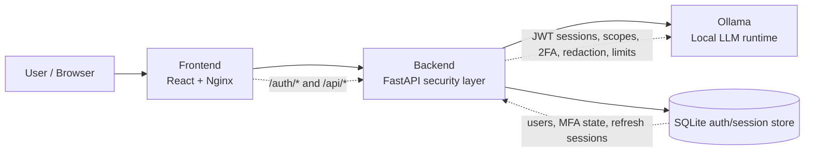
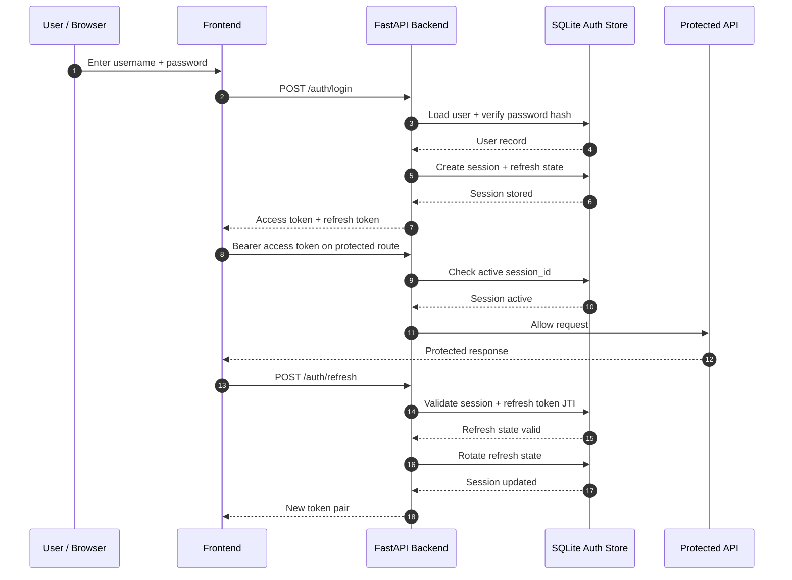
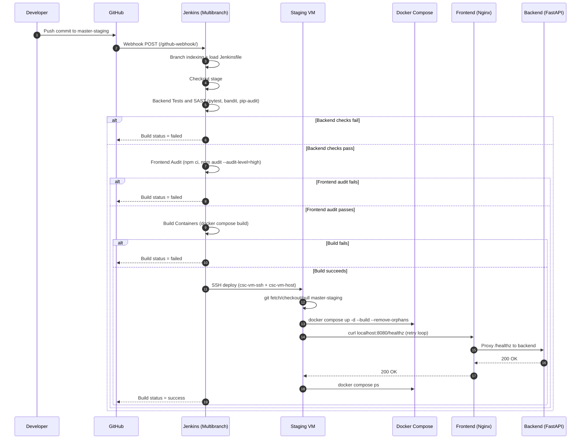

# Secure LLM Assistant

This repository is a secure local LLM application built around one main idea:

The user should never communicate directly with the model. Every request goes through a FastAPI backend that acts as a security gateway in front of Ollama.

That makes this repository less of a generic chat app and more of a secure systems project. The main implementation themes are:

- backend-first trust boundary
- JWT authentication with a server-side session database
- refresh token rotation and logout revocation
- optional TOTP-based 2FA
- prompt sanitization and PII redaction
- rate limits and token guardrails
- containerized deployment and Jenkins CI/CD

## AI Disclaimer

This project uses a language model to generate responses. Model output can be incorrect, incomplete, biased, or misleading, so it should be treated as assistant output rather than authoritative fact or professional advice.

Language models were also used during development as coding assistants. Final implementation choices, integration, testing, and repository contents were reviewed and controlled within the project workflow.

## Architecture

The runtime is split into three services:

- `frontend`: React UI served by Nginx
- `backend`: FastAPI security layer
- `ollama`: local LLM runtime

Request flow:

`User -> Frontend -> Backend -> Ollama`

This separation is the most important design choice in the repository.

Why it was done:

- The frontend stays focused on UX.
- The backend becomes the single place where security policy is enforced.
- Ollama is not exposed directly to the user.
- Authentication, authorization, redaction, and rate limits are applied before model access.

### Architecture Diagram



## What To Look At First

If you are reviewing the project for implementation quality, open these files first:

- `backend/app/main.py`
- `backend/app/auth.py`
- `backend/app/security.py`
- `backend/app/llm_service.py`
- `frontend/src/App.jsx`
- `docker-compose.yml`
- `Jenkinsfile`
- `SECURITY.md`

## Backend

### `backend/app/main.py`

This is the main API entrypoint. It defines:

- health endpoint
- login / register / refresh / logout routes
- 2FA setup and management routes
- normal chat endpoint
- streaming chat endpoint

It is also where the backend connects the security pieces together:

- request validation with Pydantic
- JWT bearer-token enforcement
- scope checks
- prompt sanitization
- prompt-injection blocking
- PII redaction
- rate limiting
- token-size guardrails

### `backend/app/auth.py`

This file contains the most important security logic in the project.

It implements:

- password hashing
- user registration and login
- JWT access tokens
- refresh tokens
- SQLite-backed session storage
- refresh token rotation
- logout revocation
- TOTP 2FA setup and verification
- scope-aware bearer-token validation

Passwords are never stored in plaintext. The backend hashes them with salted PBKDF2-HMAC-SHA256 before saving them in the SQLite auth store.

The key point is that this project does not rely on stateless JWTs alone. It uses a server-side session store so the backend can:

- track active sessions
- rotate refresh tokens
- reject replayed refresh tokens
- revoke sessions on logout

That makes the authentication model much stronger than a basic JWT demo.

### `backend/app/security.py`

This file contains LLM-oriented and privacy-oriented input/output protections:

- control character stripping
- whitespace normalization
- regex-based prompt-injection detection
- PII redaction for common sensitive data
- log-safe sanitization
- approximate token counting for guardrails

This was added because LLM applications need protections beyond normal form validation. Prompts can be malicious, and sensitive data should not be passed through or logged carelessly.

### `backend/app/llm_service.py`

This file wraps communication with Ollama.

It exists to keep model access separate from the rest of the backend. It handles:

- request payload construction
- timeouts
- upstream error handling
- streaming response parsing
- connection reuse

## JWT Session Database And 2FA

This is one of the strongest parts of the implementation.

The authentication model uses:

- short-lived access tokens
- refresh tokens
- a SQLite-backed session database

Why this matters:

- protected routes can check whether the session is still active
- logout can revoke access immediately
- refresh token rotation can detect and reject replay attempts

2FA is implemented with TOTP:

- backend uses `pyotp`
- frontend renders a QR provisioning code
- enabling 2FA requires a valid OTP
- future logins require password plus OTP
- disabling 2FA also requires a valid OTP

This makes the repository a good example of practical session security, not just basic login handling.

### Authentication Sequence



## Frontend

The frontend lives mainly in `frontend/src/App.jsx`.

It implements:

- login
- account creation
- session restoration
- streaming chat UI
- 2FA setup and management
- logout

The frontend talks only to backend routes such as `/auth/login`, `/auth/register`, `/auth/refresh`, `/api/chat`, and `/api/chat/stream`.

Model output is rendered as plain text in the UI. The app does not use raw HTML rendering for assistant output, which reduces output-handling risk on the client side.

The 2FA UI was designed so that setup is visible when needed, but once 2FA is enabled, the chat stays the main focus and only a compact protection indicator remains.

### UI Walkthrough

The main frontend states are:

1. Sign-in screen:
   - username and password entry
   - automatic OTP field when the account requires 2FA
2. Create account screen:
   - local account registration
   - password policy guidance
3. 2FA setup flow:
   - QR provisioning
   - manual secret fallback
   - OTP verification to enable MFA
4. Protected chat view:
   - compact 2FA status indicator
   - streaming responses
   - chat remains the primary focus after setup

## LLM-Specific Security Controls

The project addresses several LLM-specific concerns directly in the backend:

- Prompt injection:
  - sanitized input
  - suspicious prompt-pattern blocking
- Sensitive information disclosure:
  - PII redaction before LLM call
  - response redaction
  - sanitized logs
- Unbounded consumption:
  - rate limiting
  - input token cap
  - output token cap
  - request timeout

These controls are explained in more detail in `SECURITY.md`.

## CI/CD And Delivery

The repository includes a Jenkins pipeline in `Jenkinsfile`.

The pipeline runs:

- backend tests with `pytest`
- Python SAST with `bandit`
- Python dependency audit with `pip-audit`
- frontend dependency audit with `npm audit`
- container build with `docker compose build`
- deployment to `master-staging`
- post-deploy health verification

This is important because the project is not only about secure code. It also demonstrates secure delivery and verification practices.

### CI/CD Flow

The pipeline can also be read visually:



## Testing

The backend test suite covers the security-critical behavior of the application, including:

- security helper functions
- registration and login
- JWT-protected API access
- refresh token rotation
- logout revocation
- 2FA flows
- scope enforcement
- streaming behavior
- Ollama service error handling

Main test directory:

- `backend/tests/`

## Repository Structure

High-value areas in the repository:

- `backend/app/`
  - backend logic and security controls
- `backend/tests/`
  - tests for security-critical behavior
- `frontend/src/`
  - login, 2FA, and chat UI
- `docker-compose.yml`
  - service topology and runtime hardening
- `Jenkinsfile`
  - CI/CD pipeline
- `.github/dependabot.yml`
  - dependency update automation

## Minimal Setup

This repository is primarily intended to be read as an implementation "tour", but if needed, the local stack can still be started with:

```bash
cp .env.example .env
docker compose up -d --build
```

Useful verification commands:

```bash
pytest -q backend/tests
npm --prefix frontend run test:run
npm --prefix frontend run build
curl http://localhost:8080/healthz
```

## API Summary

Main routes:

- `POST /auth/login`
- `POST /auth/register`
- `POST /auth/refresh`
- `POST /auth/logout`
- `GET /auth/2fa/status`
- `POST /auth/2fa/setup`
- `POST /auth/2fa/enable`
- `POST /auth/2fa/disable`
- `POST /api/chat`
- `POST /api/chat/stream`

## Security Notes

For the security posture, residual risks, and OWASP LLM mapping, read:

- `SECURITY.md`
